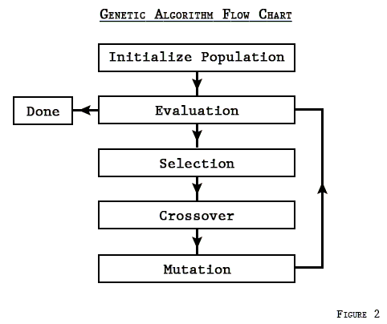

# Umělá evoluce a evoluční algoritmy

Tato přednáška představuje základní principy umělé evoluce a evolučních algoritmů, které využívají inspiraci z přírodního evolučního procesu (např. Darwinovy teorie) k řešení složitých optimalizačních úloh. Evoluční algoritmy jsou mimořádně užitečné zejména tehdy, když nevíme přesně, jak má ideální řešení vypadat, ale známe požadované vlastnosti.

## Základní principy umělé evoluce

- **Inspirace z biologie:**
  Evoluční algoritmy vycházejí ze základních principů přírodní evoluce:
  - **Dědičnost:** Jedinci mohou zdědit vlastnosti od svých rodičů.
  - **Variabilita:** V populaci existují rozdíly, které umožňují vznik nových řešení.
  - **Přírodní výběr:** Jedinci s lepšími vlastnostmi mají větší šanci přežít, rozmnožit se a předat své vlastnosti dál.

- **Náhodná inicializace:**
  Na začátku generujeme populaci jedinců (řešení) náhodně – počáteční řešení mohou být neplatná nebo nekvalitní, ale obsahují základní genetickou informaci.

### Koncept evolučního algoritmu

## Evoluční proces a klíčové komponenty

Evoluční algoritmy pracují v iteracích (generacích), kde se populace jedinců postupně zlepšuje. Hlavní kroky jsou:

### 1. Kódování jedinců

Každý jedinec představuje řešení úlohy a může být zakódován různými způsoby:
- **Binární kódování:**
  Jedinec je řetězec 0 a 1 – původní metoda používaná Hollandem.

  

- **Stromové kódování:**
  Používá se pro složitější struktury (např. rozhodovací stromy, programy).

  

- **N-tice nebo tabulkové kódování:**
  Vhodné pro reprezentaci posloupností nebo akčních plánů.

  

### 2. Fitness funkce

Fitness funkce hodnotí, jak dobré je řešení reprezentované jedincem. Příklady:
- **Optimalizace funkce:** Fitness je hodnota funkce v daném bodě.
- **Hledání strategie:** Fitness získáme opakovaným spuštěním strategie proti soupeřům a vyčíslením výher.
- **SAT problém:** Fitness = počet splněných klauzulí.
- **Optimalizace designu:** Například tvar křídla, kde fitness vychází z fyzikálních simulací.
- **Hledání maxima f(x):** Jedinec reprezentuje bod x, jeho fitness je hodnota funkce v tomto bodě.

#### Maximalizační fitness funkce

#### Minimalizační fitness funkce

### 3. Selekce

Selekce hraje klíčovou roli – vybírá jedince pro rozmnožování. Cílem je přenést do další generace silné jedince, ale zároveň udržet diverzitu a vyhnout se uvíznutí v lokálním maximu.

Běžné metody selekce:

- **Ruletová selekce:**
  Jedinci mají podíl na „ruletovém kole“ úměrný své fitness. Výběr probíhá „točením“ kola.
  - Výhody: jednoduchost, rovnováha ve velké populaci.
  - Nevýhody: může preferovat jen silné jedince → ztráta diverzity.

  

- **Stochastic Universal Sampling (SUS):**
  Zlepšení ruletové selekce – jeden náhodný bod a rovnoměrné dělení.
  - Výhody: rovnoměrné pokrytí, stabilnější výběr.
  - Nevýhody: složitější implementace.

  

- **Elitismus:**
  Nejlepší jedinci jsou automaticky zachováni do další generace.
  - Výhody: uchování nejlepšího řešení.
  - Nevýhody: může vést k dominanci a ztrátě rozmanitosti.

- **Turnajová selekce:**
  Náhodná skupina (např. 2) → výběr silnějšího s pravděpodobností (např. 75 %).
  - Výhody: jednoduchost, řízená diverzita.
  - Nevýhody: závislost na náhodném výběru.

- **Boltzmannova selekce:**
  Inspirováno žíháním. Zpočátku jsou preferováni i slabší jedinci, postupně více ti silní.
  - Výhody: udržuje diverzitu na začátku.
  - Nevýhody: nutnost nastavit teplotní plán, složitější.

### 4. Genetické operátory

Pro vytvoření nové generace se využívají:

- **Crossover (křížení):**
  Kombinace genetické informace dvou rodičů.

  

  #### Jednobodový crossover
  

  #### Dvoubodový crossover
  

  #### Vícebodový crossover
  

- **Mutace:**
  Náhodná změna v jedinci, přináší novou genetickou informaci.

  

### 5. Evoluční cyklus

Fáze algoritmu:
- **Inicializace:** Náhodná populace.
- **Hodnocení:** Výpočet fitness.
- **Reprodukce a genetické operátory:** Vytvoření nové generace.
- **Opakování:** Dokud není splněné kritérium (čas, kvalita).

#### Evoluční algoritmus – cyklus

#### Evoluční algoritmus – schéma

## Hollandovy genetické algoritmy

John Holland představil genetické algoritmy ve své knize *Adaptation in Natural and Artificial Systems* (1975). Jeho přístup se stal základem pro celou oblast:

- **Definice kódování jedinců**
- **Nastavení selekčního mechanismu**
- **Návrh genetických operátorů (crossover, mutace)**
- **Stanovení fitness funkce**

Tento rámec lze aplikovat na širokou škálu problémů – od barvení grafu po evoluční programování.

## Aplikace evolučních algoritmů

### Výhody

- **Snadná implementace:**
  Jednoduché přizpůsobení různým problémům.

- **Paralelizace:**
  Hodnocení jedinců může probíhat nezávisle.

- **Schopnost řešit složité úlohy:**
  Efektivní i tam, kde selhávají tradiční metody.

- **Použitelnost i bez znalosti ideálního řešení:**
  Postačí znát požadované vlastnosti.

## Nevýhody

- **Nemusí najít globální optimum:**
  Hrozí uvíznutí v lokálním optimu.

- **Pomalá konvergence:**
  Zvláště u členitých fitness krajin.

- **Citlivost na parametry:**
  Úspěch závisí na správném nastavení (velikost populace, mutace…).

- **Riziko ztráty diverzity:**
  Přílišná dominance silných jedinců.

## Oblasti využití

- **Optimalizace designu:**
  Např. u Boeingu 777 – evoluce tvaru lopatek vedla k úspoře paliva.

- **Návrh antén:**
  NASA navrhla netradiční antény pomocí evoluce.

- **Forenzní identifikace:**
  Skládání podoby pachatele ze segmentů tváře.

- **Generativní umění:**
  Evoluční tvorba obrazů.

- **Návrh architektur neuronových sítí:**
  Evoluční hledání nejlepší struktury.

## Závěr

Evoluční algoritmy jsou flexibilní a univerzální nástroje pro optimalizační úlohy, obzvlášť když ideální řešení není předem známo. Díky principům jako selekce, křížení a mutace dokáží tyto algoritmy postupně zlepšovat populaci řešení a nalézt velmi kvalitní řešení i pro náročné problémy.

Zkoušej různé evoluční strategie a aplikuj je na konkrétní problémy – od barvení grafu až po návrh strojů či umění. Evoluční algoritmy opakovaně dokazují svou sílu a univerzálnost.
