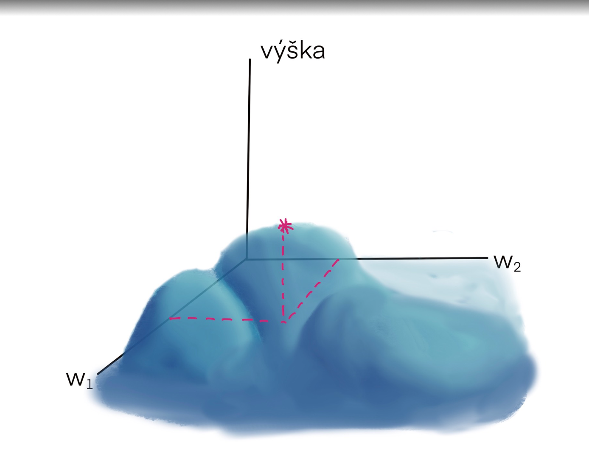
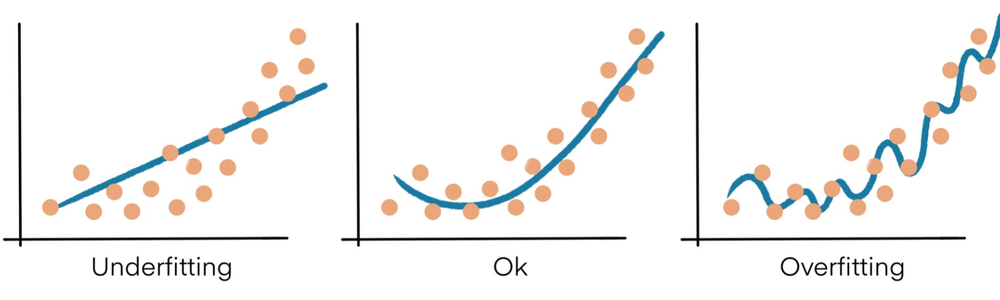
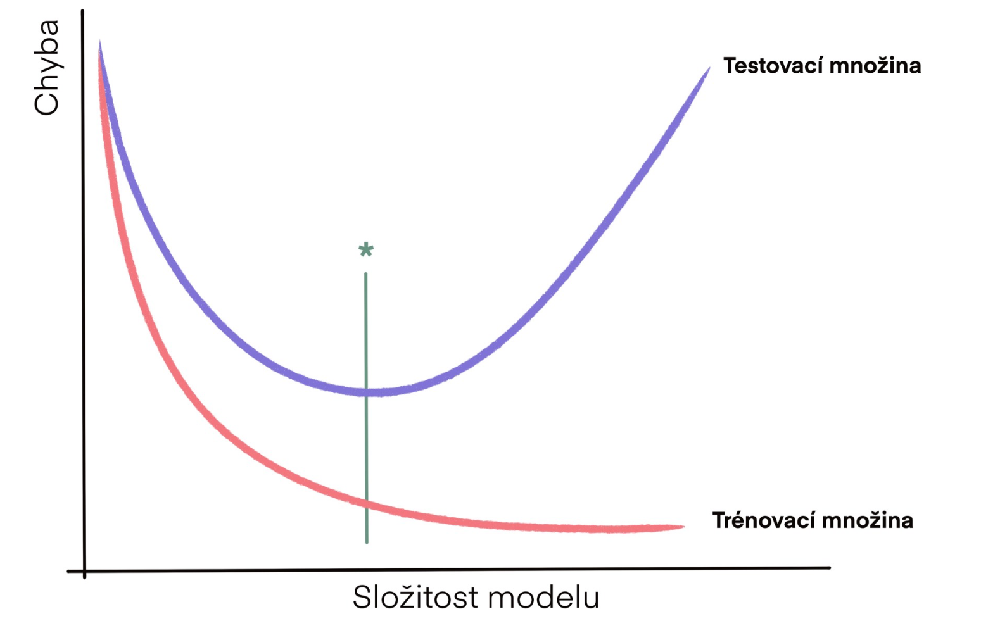

## Úvodní rozdělení typů učení

Inteligentní agenti mohou vykazovat různé typy učení podle toho, jaké informace jsou k dispozici:

- **Se zcela chybějícími informacemi**: agent si sám objevuje strukturu dat či situací.
- **S evaluací**: pro každou situaci máme zpětnou vazbu (skóre, odměnu).
- **S učitelem**: máme tréninkovou množinu vstup–výstup, kde učitel značí správné řešení.

Podle toho rozeznáváme:
1. Učení s učitelem (supervised learning)
2. Posilované učení (reinforcement learning)
3. Učení bez učitele (unsupervised learning)

---

## 1. Učení s učitelem (Supervised learning)

### Vstupní data a formát

- Trénovací sada: páry $(\mathbf{x}_i, \mathbf{y}_i)$, kde:
  - $\mathbf{x}_i \in \mathbb{R}^n$ je vstupní vektor,
  - $\mathbf{y}_i \in \mathbb{R}^m$ je požadovaný výstup.

### Cíl učení

- Najít parametry (váhy a prahy) neuronové sítě $f_{\theta}(\mathbf{x})$, aby pro všechny vzory minimalizovala chybu.
- Odhadujeme reálnou (neznámou) funkci na základě omezené množiny vzorků.
- Důležitá je **generalizace**: dobré výsledky i na datech, která síť neviděla.

### Měření chyby (Mean Squared Error)

Pro jeden tréninkový pár:

$$ E_i = \|\mathbf{y}_i - f_{\theta}(\mathbf{x}_i)\|^2 = \sum_{j=1}^{m} (y_{i,j} - \hat y_{i,j})^2 $$

Celková chyba:

$$ E = \sum_{i=1}^{N} E_i $$

---

## 2. Backpropagation

- **Účel**: Najít (alespoň lokální) minimum chybové funkce $E(\theta)$.
- **Postup**:
  1. Spočítat výstup sítě pro tréninkovou sadu.
  2. Vyčíslit chybu $E$.
  3. Pomocí parciálních derivací (řetízkové pravidlo) spočítat gradient $\nabla_{\theta} E$.
  4. Aktualizovat váhy: $\theta \leftarrow \theta - \eta \, \nabla_{\theta} E$, kde $\eta$ je učicí konstanta.
  5. Iterovat, dokud chyba neklesne pod zvolenou hranici.

### Vlastnosti

- Vhodné pro online i batch učení.
- Výpočetně náročné pro velké sítě.
- NP-úplný problém pro sítě s prahovými neurony, i při 3 neuronech.

---

## 3. Alternativní učicí algoritmy

- **Silva–Almeida**: adaptivní učicí konstanta (každá váha má vlastní $\eta_i$).
- **Delta-bar-delta**: opatrnější adaptace, ruční nastavení zrychlení.
- **Rprop**: rychlé překonání plochých regionů.
- **Quickprop**: druhého řádu, využívá druhé derivace.
- **QRprop**: adaptivní přepínání mezi Rprop a Quickprop.
- Mnoho dalších moderních vylepšení, vždy ale řeší globální nestandardní optimalizaci.

---

## 4. Aplikace a limitace neuronových sítí

### Výhody

- Silné generalizační schopnosti.
- Vhodné pro problémy, kde je přesné řešení drahé.

### Nevýhody

- Vyžadují rozsáhlá trénovací data.
- Riziko **overfittingu**: naučí se šum trénovacích dat.
- Zranitelnost vůči adversariálním útokům.
- Černá skříňka: obtížná interpretace vnitřní funkce.
- Výpočetně náročné.
- Potřebná expertní znalost návrhu architektury a hyperparametrů.

---

## 5. Nastavení neuronové sítě

1. **Topologie**
   - Počet skrytých vrstev a neuronů v nich.
   - Začít se 1 skrytou vrstvou, postupně přidávat.
   - Možnost evolučních algoritmů pro návrh struktury.

2. **Počáteční váhy**
   - Náhodný výběr z \([-a, a]\).

3. **Hyperparametry**
   - Učicí konstanta $\eta$, momentum, regularizace.

### Podstata overfittingu

- Příliš mnoho neuronů \(\to\) příliš složitá síť.
- Příliš málo neuronů \(\to\) underfitting.

---

## 6. Techniky pro lepší učení a regulaci

- **Early stopping**: rozdělit data na trénink a validaci, zastavit dříve, než se začne růst chyba na validaci.

- **Regularizace**
  - L1 a L2 penalizace váhových hodnot.
- **Dropout**
  - Náhodné vypínání neuronů během tréninku.
- **Adaptivní učení**
  - Silva–Almeida, Delta-bar-delta, Rprop aj.
- **Moment**
  - Přidat setrvačnost v aktualizacích váh.
- **Šum**
  - Přidání náhodného šumu do gradientu.

---

## 7. Jiné metody učení s učitelem

- Lineární regrese
- Support Vector Machines (SVM)
- Random Forests
- K-Nearest Neighbors (KNN)
- Decision Trees

*Poznámka*: Tyto metody nevyžadují neuronové sítě, jsou často rychlejší a interpretovatelnější.

